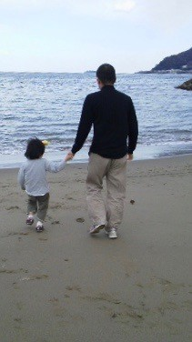

<!-- Title: どのぐらいしかるのか（頻度と度合い） - 子どものしかりかた (4/7)  
Date: December 06, 2017  
Chapter: 4  
Author: @motohasi    -->

# どのぐらいしかるのか（頻度と度合い）
## わからないことは宝である
<!-- 継続することで力をつけ，極端を通じて器を大きくし，その中で失敗して学ぶことができる． -->

**営為を継続することで力をつける：**
歯磨きから計算，水泳の練習から空手の稽古まで，継続の中で力をつけることができる．一度だけでは，それぞれの行為をうまくやることができない．気の遠くなるように繰り返し，継続することによって身につけることができる．継続と言えども，まったく同じことをしているわけではない．物事の理解を深め，深くそして広く学ぶことになる．

**営為を継続することで極端や未知を知り器を大きくする：**
まったく経験がなければ，なにごとも未知のことである．未知のことを少しずつ広げることが，経験に繋がる．未知のことは，その時の範囲から超えているため極端とも言える．大きく外れているが，極端を経験することによって，未知の幅を広げることができる．わからないことを目にして，どうこうすることで少しずつ成長する[^bricolage]．

[^bricolage]: フランスの文化人類学者・クロード・レヴィ＝ストロースのブリコラージュと呼ぶものを示す．

**わからないことは宝物である：**
このようにわからないこと（未知）は宝物である．それぞれの子どもは，宝物を少しずつ探して，自分のものにする．そのわからないことがわかるようになるまで，数年かかるか数十年かかるか，一生わからないままですごすかも わからない．

**宝探しをしよう：**
子どもの宝物は親にはわからないし親が見つけるものでもない．自分ならでは宝物をさがしてみよう．子ども自身が宝を見つける必要がある．

**いかにわからないことに直面するのかが大切である．**

## しかる頻度
*何度しかっても聞いてくれないから，よくしかっている*

**しかることには，怒りの感情が多少なりとも含まれがち** であることを理解しよう．怒られる子どもは，怒った親に比べて気持ちや感情など精神的な影響が大きい[^anger]．ましてや，子どもは逃げることが困難なため，その影響は親から想像できないほど大きくなる．

[^anger]:[なぜ"怒りっぽい人"は嫌われ、孤立するか ポイントは「グリップ力の弱さ」：PRESIDENT Online - プレジデント](http://president.jp/articles/-/23212)の「怒る側と怒られた側、大きな意識の違いがある」を参照のこと．

**怒りの感情は影響が大きいため，理不尽に怒られ続けていると身を守るか反撃にでるしかない．**
なぜならば，理解せずに怒られ続けていると混乱し，思考が停滞する．そのような停滞状況を回避したくなるからだ．身を守る行動は，無視する，他のことを考えるなど防御する態度をとることになる．たとえば，いつも怒られている（＝しかられている）状況では，もはや無視することや殻にこもることが常態化し，どうでもよくなってしまう．場合によっては，帰宅しないなどの逃避行動にである．反撃は，炭火のように怒りの感情がたまるか，蓄積され爆発するなどの行動にでるようだ．

**いちばんの問題は，しかっている内容は子どもには伝わらないことだ．**
そのため，どのように効率よく伝えるのかを考える必要がある．その中の一つとしてしかることがある．これは，子どもと親の状況によるため一概には言えないが，その親子を見ていくしかない．

**しかられた内容を理解し，行動を修正するためには，数週間から数ヶ月はかかる．**
自分自身のよくないことは習慣や癖になっていて，自動的に行われているため，すぐに修正できない．しかられたことを理解し，修正しようとしている最中に，他のことを言われても混乱するだけで，修正が遅くなる．

この「自分で生きていくために何が必要か」のポイントをどこに置くのかによって子育ての内容が違う．なぜなら，親の経験を通じて，身につけてほしいポイントが異なってくるからだ．

**しかる頻度は，最小になるよう親が努力しよう．**
強い態度で責めることは，健康的なコミュニケーションとは言えない．人生経験があり立場が強いのは親なので，しかる頻度を最小にするよう努力しよう．全く怒らない／しからないゼロの状態を目指そう[^frequency]．

[^frequency]: 現時点で，子どもたちに確認したところ，ほとんど怒らない／しかられないとのことであった．今後は，難しい時期が来るため，また異なった状態になるとは思っている．

## 口調や態度の厳しさの度合い・細かいことを気にするな
*いつも怒鳴ってばかりで疲れる*

**口調や態度の厳しさを決めてメリハリをつける：**
最初は，気がついたベースでしかっていると，その都度，子どもが心配や不安になっていた．気遣いすることを学ぶが，自分で考え，自分で判断して行動するようにはならない．そこで，どのような時に厳しく接し，どのようなときに優しく接するのかの度合いを明確にした．

**口調や態度の厳しさ（例）：**
危険な行為は口調や態度が厳しくなり，大事ではないことは指摘するに止まる．下のリストの 1.叱咤，2.注意，3.指摘のようにリストの上のものは，口調や態度が厳しい．たとえば，このリストにあるように，子どもたちとは合意されている：

1. **叱咤：厳しい口調**
	- 生き延びるために必要なこと
	- 安全のために必要なこと（大怪我，大火傷，死亡に至る交通事故など）
2. **注意：**
	- 自分を大切にしない言動
	- 他人や物を大切にしない言動／迷惑をかけること（ただし，程度による）
	- 繰り返し無視すること（返事や挨拶）
3. **指摘**
	- 健康を損ねること（入眠や手洗いの励行）
	- 文化的な慣習（箸の持ち方／食べ方）
	- きちんと自分の意見を言わないこと
	- 卑屈になること
4. 上記に当てはまらないこと
	- 宿題やテストの結果が悪いとき（悪けれどショックは受けるケド）
	- 忘れ物や怠けること

たとえば，交通ルールの赤信号と一時停止の無視は事故に結びつくため激しい口調で怒鳴る（なお，自分の子どもだけでなく，子どもに危害を与えそうになった他者に対しても遵守するよう厳しい口調で接する）．たとえば，正しくお箸を持てない，挨拶をしないなどの場合は「食べ終わったらお箸の練習をしよう」とか「（東京において）挨拶は大切だよ」の指摘になる．言われたことが伝わっていない時は，だんだん口調が厳しくなることもあるし，他の方法を考えることもある．

このリストは，親から子どもだけでなく，子ども同士のやりとりにも適用される．たとえば，3. や 4.の内容を厳しく叱咤した場合は，指摘した人に「やさしい気持ち，やさしい言葉で伝えようね」と指摘する．このように，細かいことは気にしないよう繰り返し伝える．

いつものようにしかっていると，それはBGMのように心に届かないし，話を聞こうとは思わない．しかし，このようにメリハリをつけて接すると，子どもも心を開くし話をよく聞いてくれる．

<!--  -->
<!-- [f:id:masanari:20110326145438j:plain]

**次の記事は [子どもが自分で行動するために判断基準を作ろう - 子どものしかりかた (5/7)](http://motohasi.hatenablog.com/entry/2017/12/14/171005)だよ．**

// # 記事一覧

1. [はじめに - 子どものしかりかた (1/7)](http://motohasi.hatenablog.com/entry/2017/12/26/044424)
2. [子育てとしかることと怒ること（定義） - 子どものしかりかた (2/7)](http://motohasi.hatenablog.com/entry/2017/12/26/044657)
3. [子どもは しかって強く育てるのか，ほめて伸ばすのか，子育ての心がけ（欺瞞と正直） - 子どものしかりかた (3/7)](http://motohasi.hatenablog.com/entry/2017/12/10/231241)
4. [どのぐらいしかるのか（頻度と度合い） - 子どものしかりかた (4/7)](http://motohasi.hatenablog.com/entry/2017/12/26/050125)
5. [子どもが自分で行動するために判断基準を作ろう - 子どものしかりかた (5/7)](http://motohasi.hatenablog.com/entry/2017/12/14/171005)
6. [なぜしかるのか，どのようにしかるのか - 子どものしかりかた (6/7)](http://motohasi.hatenablog.com/entry/2017/12/26/051025)
7. [おわりに - 子どものしかりかた (7/7)](http://motohasi.hatenablog.com/entry/2017/12/26/051217)

読んでくださり，ありがとうございました．よろしければシェアや いいねをお願いします． -->
